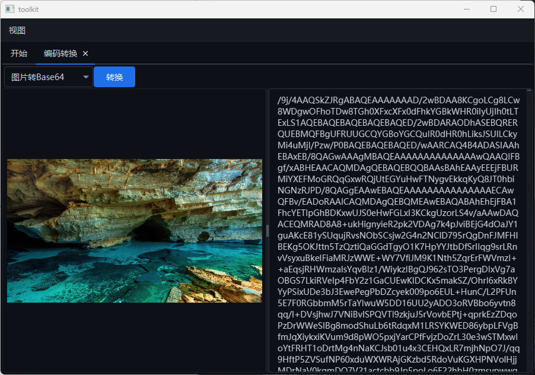
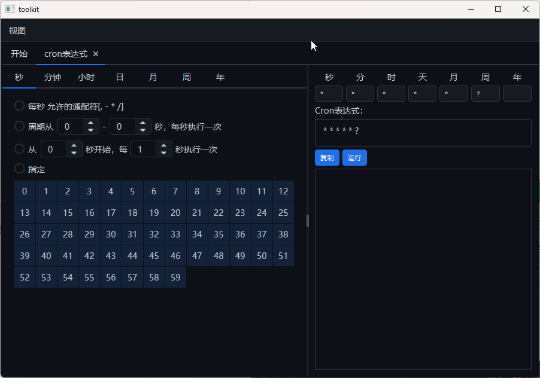
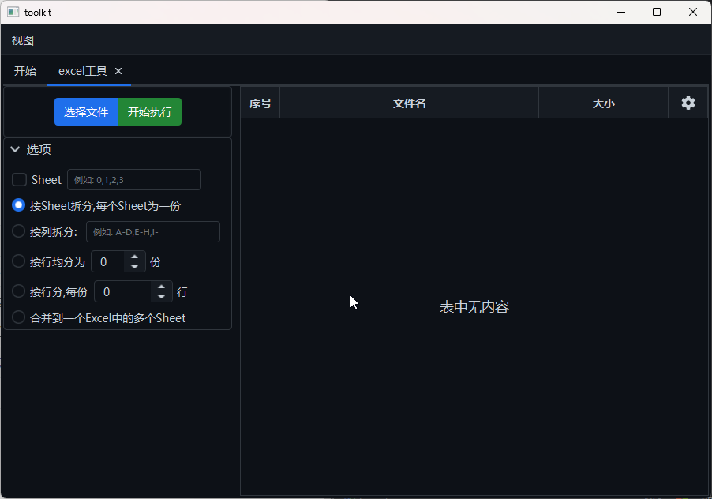
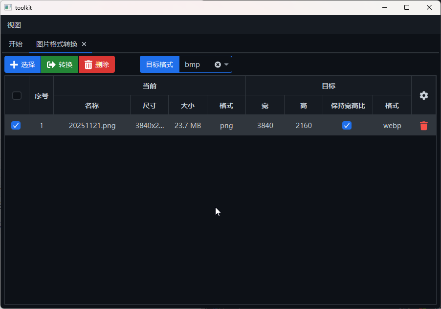
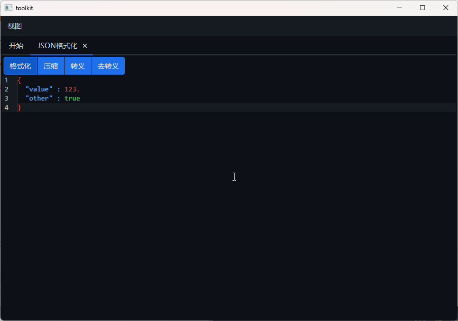
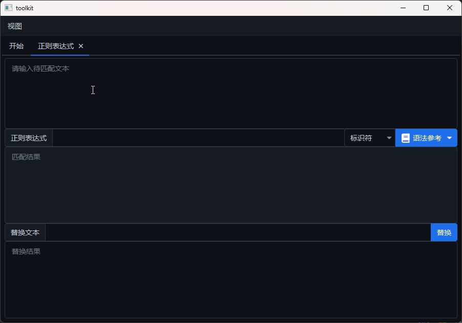
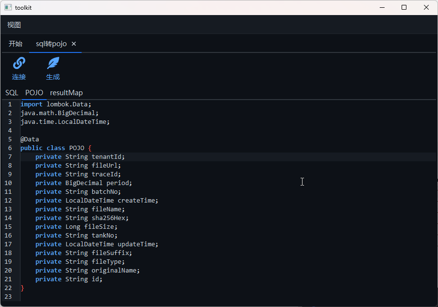

### com-toolkit

#### 简介

学习JavaFX的使用,开发了一些常用工具

#### 目前集成的工具

| 序号 | 模块          | 工具       | 简介                                             |
| ---- | ------------- | ---------- | ------------------------------------------------ |
| 1    | charset-tool  | 编码转换   | Base64<=>图片丶URL编码解码丶字符集转换丶进制转换 |
| 2    | cron-tool     | cron表达式 | cron表达式生成解析测试                           |
| 3    | excel-tool    | excel工具  | excel拆分合并                                    |
| 4    | image-tool    | 图片转换   | 图片格式大小转换                                 |
| 5    | json-tool     | json格式化 | json格式化处理                                   |
| 6    | qrcode-tool   | 二维码生成 | 二维码生成                                       |
| 7    | regex-tool    | 正则表达式 | 正则表达式                                       |
| 8    | sql2pojo-tool | sql转pojo  | sql查询转为pojo类和mybatis的resultMap            |
| 9    | cpbio-tool    | sap->doris | sap表转为doris建表语句                           |

#### 功能截图

